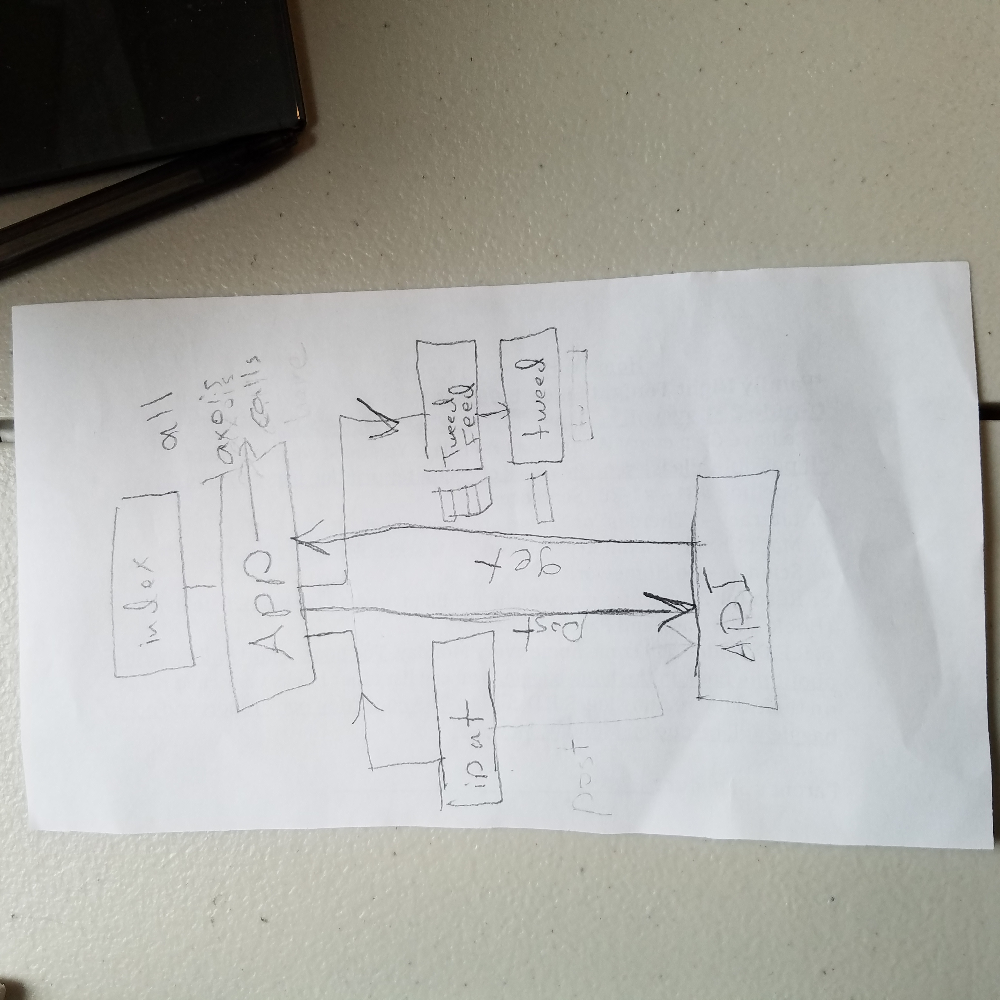

## Tweedr App

### Group

Esraa Alaarag 
Naomi Meyer 
Francheska Guzman

### Components

1. App: Holds calls to the database.
2. Header
3. Input: Takes a text input, and allow it to be submitted into the database.
4. TweedrFeed: Holds Tweed components, which reflect the information in the database.
5. Tweed: Holds one individual tweed.

### Planning

